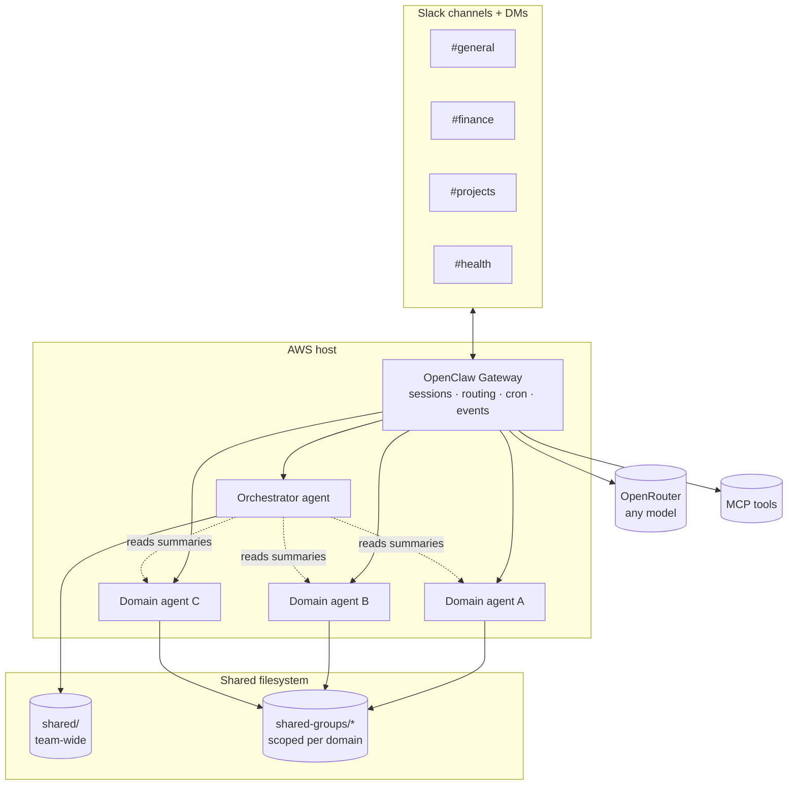

# OpenClaw Fleet — Multi-Agent Skeleton

A sanitized, reusable skeleton for a **self-hosted fleet of specialized LLM agents** built on [OpenClaw](https://github.com/openclaw/openclaw). It's both a **reference architecture** for personal multi-agent systems and a **bootstrap template** you can clone to stand up a fresh fleet.

> 🔒 **Sanitized template.** This repo contains *structure only* — no memories, no credentials, no personal data, no server details. Every persona, channel, and group here is a generic placeholder. The live system this is modeled on keeps all of that in `memory/`, `credentials/`, and `sessions/` directories that are **never** committed (see [`.gitignore`](.gitignore)).

---

## What this is

A single AWS host runs an OpenClaw **gateway** that supervises a roster of specialized agents. Each agent:

- owns a **domain** (orchestration, finance, projects, health, career, household ops, …),
- has its own **persona** (`IDENTITY.md` + `SOUL.md`), **model**, and **Slack channel**,
- reads/writes only the **shared groups** it's scoped to (a simple file-based access-control model),
- can run on a **cron schedule** (e.g. a morning brief) or purely on-demand,
- routes to any model through **OpenRouter**, and calls tools over **MCP**.

## Architecture



## The agent roster (archetypes)

Real fleets mix one orchestrator with several domain specialists. This skeleton ships generic archetypes you rename and reskin:

| Archetype | Role | Schedule |
|---|---|---|
| **orchestrator** | Compiles a daily brief by reading every domain's summary; cross-agent coordination | cron (daily) |
| **finance-analyst** | Owns the finance shared-group; budgets, tracking, summaries | on-demand |
| **project-manager** | Tracks side-projects and ventures; status rollups | on-demand |
| `_TEMPLATE` | Empty agent — copy it to add a new specialist | — |

## Repo layout

```
openclaw.example.json     # sanitized gateway/agent config (placeholders)
REBUILD.md                # bootstrap a fresh fleet from this skeleton
docs/
  ARCHITECTURE.md         # how the pieces fit (gateway, agents, groups, cron, MCP)
  SHARED-GROUPS.md        # the file-based access-control model
agents/
  _TEMPLATE/              # copy this to add an agent
  orchestrator/           # example: the daily-brief orchestrator
  finance-analyst/        # example: a scoped domain specialist
  project-manager/        # example: a second domain specialist
```

Each agent directory holds: `IDENTITY.md` (one-liner card), `SOUL.md` (persona + scope), `AGENTS.md` (operating instructions + data access), `HEARTBEAT.md` (periodic tasks), `TOOLS.md` (environment notes).

## Why it's interesting

- **Separation of concerns across agents** — each agent is small, single-purpose, and independently testable, communicating through well-defined shared files rather than shared memory.
- **Capability-scoped access** — a finance agent literally cannot read the health group; access is enforced by which directories each agent's instructions grant.
- **Model-agnostic** — every agent picks its own model via OpenRouter, so cost and capability are tuned per role.
- **Disaster recovery** — because the whole fleet is declarative (config + markdown personas), this skeleton rebuilds a working system from scratch; only memories and credentials need restoring.

See [`docs/ARCHITECTURE.md`](docs/ARCHITECTURE.md) for the deep dive and [`REBUILD.md`](REBUILD.md) to stand one up.
